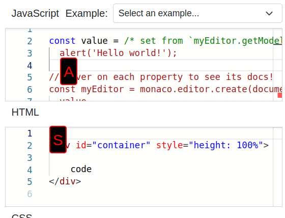
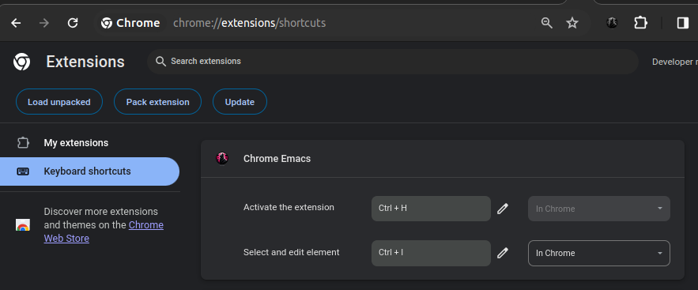

<div align="center">


</div>

This is a [Chrome Extension](https://chromewebstore.google.com/detail/chrome-emacs/dabdpcafiblbndpoadckibiaojbdnpjg) focused on bi-directional editing in online text editors and text areas from within Emacs.

After the original Atomic Chrome extension was removed from the Chrome Web Store due to policy violations, I undertook the task of creating an entirely refreshed and compliant version. Now named "Chrome Emacs," it represents more than just a fork; it is a comprehensive rewrite that adheres to the newest standards and Chrome Extension Manifest V3, ensuring both compliance and enhanced security.

Differences between the original and the forked package, as well as other similar packages, like [GhostText](https://github.com/fregante/GhostText/tree/main):

- **Support for the Monaco Editor**: Expands the range of compatible online editors far beyond the original. Note, GhostText also supports the Monaco Editor but without position and scroll synchronization.
- **Editable Areas Navigation with Hints**: Introduces a navigation feature where editable areas are overlaid with hints (letters). Pressing the corresponding letter key on the keyboard allows users to swiftly switch focus to those areas, enhancing usability and editing efficiency.
- **Migration to Chrome Extension Manifest V3**: Guarantees that the extension stays compatible with the latest browser versions and meets current security standards.
- **Cursor and Scroll Synchronization**: The motivation for this comes from the live-coding experience during online interviews. Unlike other solutions, it focuses not only on editing text areas but also on providing a seamless live-code experience in online editors.
- **Auto-Major Mode Detection**: Automatically configures the most suitable editing mode for any given online editor.
- **Complete Rewrite in TypeScript**: This enhances the extension's stability, maintainability, and performance.


Chrome Emacs is compatible with several widely-used online editors, including:

- ☒ [codepen.io](https://codepen.io/)
- ☒ [stackblitz.com](https://stackblitz.com/)
- ☒ [jsfiddle.net](https://jsfiddle.net/)
- ☒ [leetcode.com](https://leetcode.com/)
- ☒ [hackerrank.com](https://www.hackerrank.com/)
- ☒ [repl.it](https://repl.it/)
- ☒ [glitch.com](https://glitch.com/)
- ☒ [plnkr.co](https://plnkr.co/)
- ☐ [codesandbox.io](https://codesandbox.io/) (Currently unsupported due to a lack of Monaco API exposure).

### Installation

#### Chrome Extension

Install the [Chrome extension](https://chromewebstore.google.com/detail/chrome-emacs/dabdpcafiblbndpoadckibiaojbdnpjg).

#### Emacs Integration

Install the corresponding Emacs package from <a target="_blank" href="https://github.com/KarimAziev/atomic-chrome">this fork</a> (recommended), or original <a href="https://github.com/alpha22jp/atomic-chrome" target="_blank">atomic-chrome</a> package.

Differences between them are that:

- **Handling large payloads:** Unlike the original package, which may not handle incomplete frames, this fork is equipped to manage large payloads efficiently.
- **Cursor and scroll synchronization:** Inspired by the need for a more fluid live-coding experience during online interviews, the [chrome-emacs](https://github.com/KarimAziev/chrome-emacs) extension and this fork focus on editing text areas and providing seamless cursor and scroll synchronization in online editors.
- **Flexible file handling:** This fork introduces the `atomic-chrome-create-file-strategy` variable, enabling refined control over the use of temporary files for editing—a feature not present in the original package. Recognizing that language servers often require file access for functionalities like code linting and autocompletion, this feature allows users to enable, disable, or customize file usage according to their needs. This flexibility ensures users have full control over their editing environment.
- **Dynamic major modes:** Recognizing the diversity of programming languages within many online editors, this fork surpasses the original package's limitation of one major mode per website. It dynamically sets major modes based on file extensions extracted from the editor instance, resulting in a more responsive and tailored editing experience.
- **Enhanced frame configuration:** Beyond the original package's limited customization of frame width and height, this fork extends customization to every frame configuration parameter. It also automatically calculates `left` and `top` positions for the frame when the Atomic Chrome client provides a `rect` with pixel dimensions and positions, offering a more adaptable and sophisticated user interface.

<details><summary> Show installation instructions
  </summary>

##### With use-package and straight.el

```emacs-lisp
(use-package atomic-chrome
  :demand t
  :straight (atomic-chrome
             :repo "KarimAziev/atomic-chrome"
             :type git
             :host github)
  :commands (atomic-chrome-start-server)
  :config
  (setq-default atomic-chrome-extension-type-list '(atomic-chrome))
  (atomic-chrome-start-server))
```

##### Manual Installation

Download the source code and place it in your desired directory (e.g., `~/.emacs.d/atomic-chrome/`):

```
git clone https://github.com/KarimAziev/atomic-chrome.git ~/.emacs.d/atomic-chrome/
```

Add the downloaded directory to the load path and require it:

```emacs-lisp
(add-to-list 'load-path "~/.emacs.d/atomic-chrome/")
(require 'atomic-chrome)
```

##### Configure

```emacs-lisp
(setq-default atomic-chrome-extension-type-list '(atomic-chrome))
```

##### Run server

```emacs-lisp
(atomic-chrome-start-server)
```

</details>

<details><summary> Show Emacs advanced configuration example
  </summary>

```emacs-lisp
(use-package atomic-chrome
  :straight (atomic-chrome
             :type git
             :flavor nil
             :host github
             :repo "KarimAziev/atomic-chrome")
  :defines atomic-chrome-create-file-strategy
  :config
  (setq-default atomic-chrome-buffer-open-style 'frame)
  (setq-default atomic-chrome-auto-remove-file t)
  (setq-default atomic-chrome-url-major-mode-alist
                '(("ramdajs.com" . js-ts-mode)
                  ("github.com" . gfm-mode)
                  ("gitlab.com" . gfm-mode)
                  ("leetcode.com" . typescript-ts-mode)
                  ("codesandbox.io" . js-ts-mode)
                  ("typescriptlang.org" . typescript-ts-mode)
                  ("jsfiddle.net" . js-ts-mode)
                  ("w3schools.com" . js-ts-mode)))
  (add-to-list 'atomic-chrome-create-file-strategy
               '("~/repos/ts-scratch/src/" :extension
                 ("js" "ts" "tsx" "jsx" "cjs" "mjs"))))
```

</details>

### Usage

https://github.com/KarimAziev/atomic-chrome/assets/24935940/e1f6875c-d917-4a8b-ad58-35d55eeb5cbb

Ensure that Emacs is running with the [atomic-chrome fork](https://github.com/KarimAziev/atomic-chrome) (or [original atomic-chrome](https://github.com/alpha22jp/atomic-chrome)) loaded and the server is running (`M-x atomic-chrome-start-server`).

1. Run `M-x atomic-chrome-start-server` in Emacs. This is needed only once.

2. Focus on or select from detected editable text areas, text editors, or contenteditable elements in Chrome.



3. Activate Chrome Emacs. This can typically be done by clicking on the extension's icon or using a keyboard shortcut.

The text will now open in an Emacs buffer, ready for you to edit.

#### How to Bind a Shortcut?



1. Navigate to `chrome://extensions`.
2. Scroll down and click on `Keyboard shortcuts` at the bottom of the page.
3. Assign a shortcut for activating Chrome Emacs. There are two available commands:

- **Activate the extension** - default action, edit focused area. If there are no focused are, try to detect them from visible part of the page.
- **Select and edit element** - Show key to press near editable elements to focus and start editing. To cancel, press either `ESC` or `Ctrl-g`.

#### Development

<details><summary>Local setup </summary>

1. Clone the repository to your local machine:
   ```
   git clone https://github.com/KarimAziev/chrome-emacs.git
   ```
2. Ensure the correct version of Node.js is installed, as specified in the [.nvmrc](https://github.com/KarimAziev/chrome-emacs/blob/16a754fc24e50034a053b18aaa4e15bbf0cad541/.nvmrc#L1) file. Switch to the correct version with `nvm use`, if using NVM.
3. Install required dependencies:
   ```
   npm install
   ```
4. Build the extension:

- For rebuilding the extension on file save, run:
  ```
  npm run dev
  ```
- For a one-time build:
  ```
  npm run build
  ```

5. Load the built `app` directory into Chrome:
   - Navigate to `chrome://extensions/`
   - Toggle "Developer mode" at the top right.
   - Click "Load unpacked" and select the `app` directory.

</details>

Your contributions to both the Chrome extension and the Emacs package are welcome!
